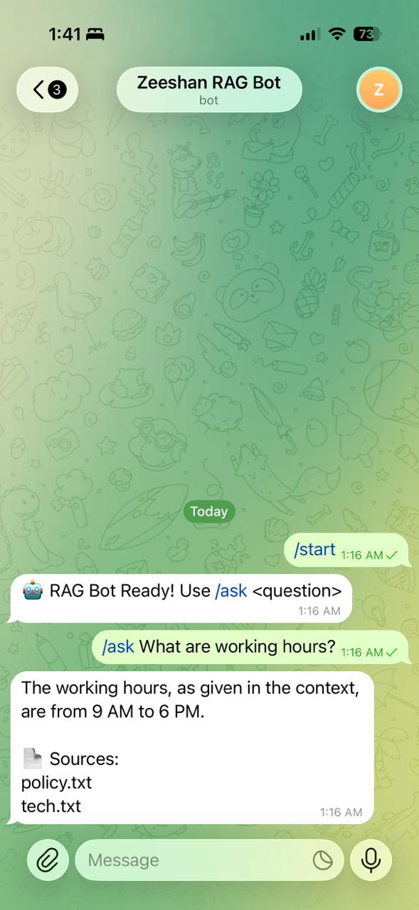

## 🔗 Demo

Telegram Bot: https://t.me/zeeshan_rag_bot


# 🤖 RAG Telegram Bot (Local LLM)

## 🔗 Demo
Telegram Bot: https://t.me/zeeshan_rag_bot

## 🚀 Overview
This project implements a Retrieval-Augmented Generation (RAG) chatbot using:
- Local LLM (Mistral via Ollama)
- Sentence Transformers (embeddings)
- FAISS (vector search)
- Telegram Bot API

## ⚙️ Features
- Answer questions from custom documents
- Source attribution
- Fully local (no OpenAI API required)

## 🏗️ Tech Stack
- Python
- Ollama (Mistral)
- FAISS
- Sentence Transformers
- python-telegram-bot

## ▶️ Setup

```bash
pip install -r requirements.txt
ollama serve
python embed.py
python app.py

💬 Usage
/ask What are working hours?

📌 Example Output

Work hours are 9 AM to 6 PM.


## 📸 Demo Screenshot


